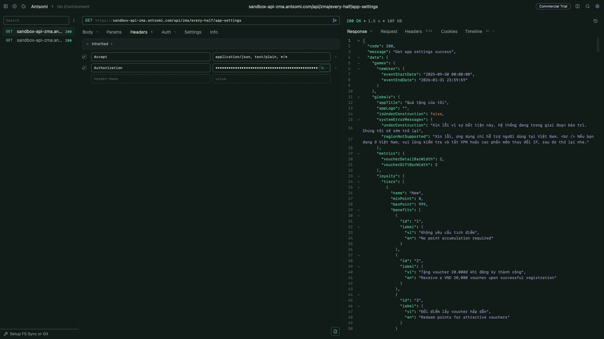

#  Hue for Yaak

> Huế-inspired themes for the [Yaak](https://yaak.app) API client — generated
> from the [Hue design token system](https://github.com/crafts69guy/hue-theme).

<p align="center">
  
</p>

Three moods drawn from the atmosphere and visual culture of Huế, Việt Nam:

| Mood | Theme ID | Appearance | Feel |
| --- | --- | --- | --- |
| **Huế Mưa** | `mua` | dark | deep charcoal, rain silver, muted jade |
| **Huế Hương** | `huong` | dark | river green, dusk blue, incense gold |
| **Huế Cung** | `cung` | light | ivory paper, imperial lacquer, royal purple |

Each mood styles Yaak's base UI palette: surfaces, text, borders, selection,
primary actions, and status colors. It does not change fonts, request data, or
workspace behavior.

## Installation

Install the plugin from Yaak's plugin settings with this repository:

```text
crafts69guy/hue-yaak
```

Then choose **Huế Mưa**, **Huế Hương**, or **Huế Cung** from Yaak's theme
selector.

### Local development

Clone the repository and build the plugin bundle:

```fish
bun install
bun run build
```

Sideload the plugin directory from Yaak's **Settings -> Plugins** screen. For
live development, run:

```fish
bun run dev
```

`yaakcli` watches the plugin and Yaak reloads it as the bundle changes.

## Development

This repository is the Yaak subtree package from
[`crafts69guy/hue-theme`](https://github.com/crafts69guy/hue-theme). The source
theme data lives in the token package, and this plugin is generated from that
contract.

In the monorepo:

```fish
# Regenerate src/index.ts from source tokens
bun run --cwd packages/tokens build

# Build the Yaak plugin bundle
bun run --cwd packages/yaak-plugin build
```

`src/index.ts` is build output. Do not edit it by hand; change the Hue tokens or
the Yaak adapter instead. Only Yaak's supported `base` UI tokens are exported.
Hue's `syntax.*` roles are omitted because Yaak's theme API has no
syntax-highlighting slots.

## Credits

Generated from the
[Hue design token system](https://github.com/crafts69guy/hue-theme) — rooted in
the visual culture of Huế, Việt Nam.

## License

[MIT](./LICENSE)
